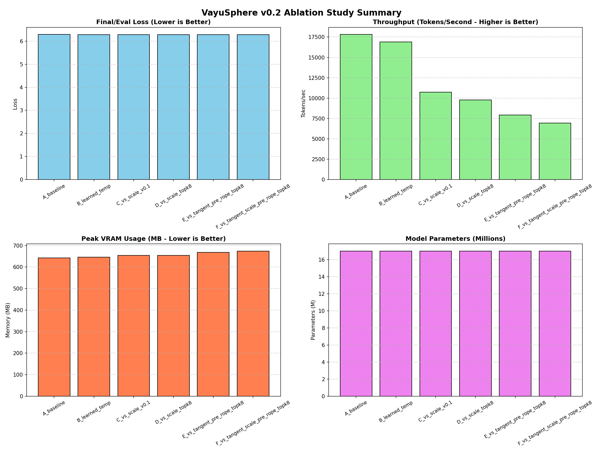
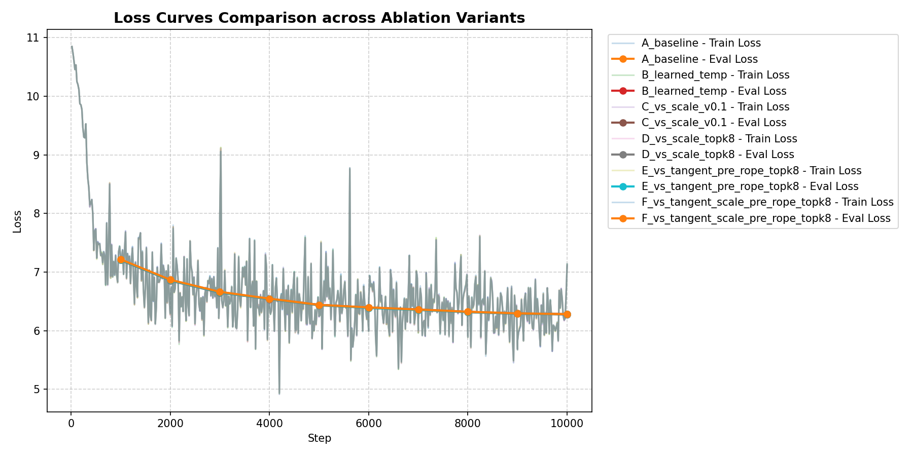
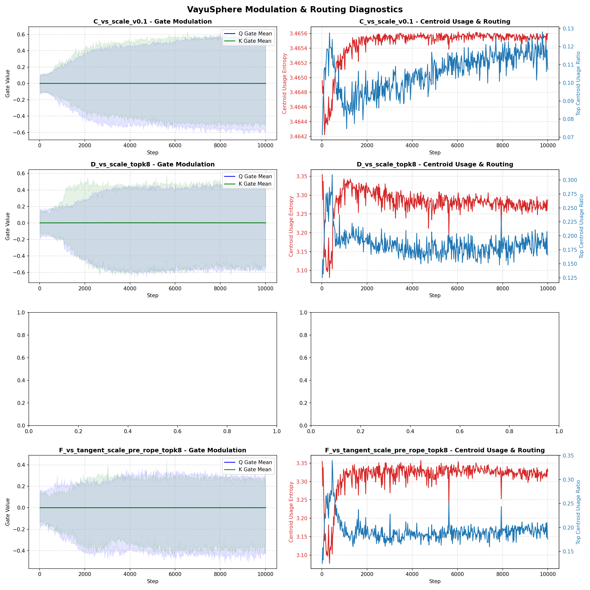
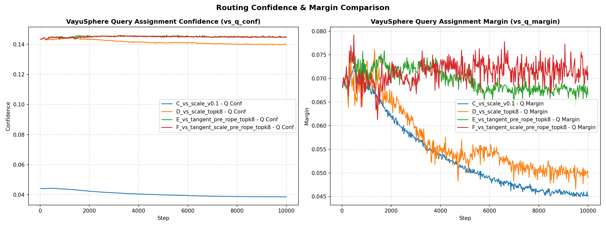

# VayuSphere v0.2 Ablation Study Report

This report documents the results of the VayuSphere v0.2 ablation study conducted on **10000 steps** using the `laptop_6gb_10m.yaml` training config.

## Executive Summary

We evaluated 6 decoder configurations to assess the impact of learned attention temperatures, spherical scaling versus tangent modulations, pre- versus post-RoPE application, and top-k routing restrictions:

1. **A_baseline**: Standard GPT baseline.
2. **B_learned_temp**: Standard GPT baseline with learned attention temperature.
3. **C_vs_scale_v0.1**: VayuSphere in `scale` mode with alpha=0.1 applied post-RoPE (modulates key-value angles after RoPE).
4. **D_vs_scale_topk8**: VayuSphere in `scale` mode with alpha=0.1 and top-k centroids=8 applied pre-RoPE.
5. **E_vs_tangent_pre_rope_topk8**: VayuSphere in `tangent` mode with alpha=0.1 and top-k centroids=8 applied pre-RoPE.
6. **F_vs_tangent_scale_pre_rope_topk8**: VayuSphere in combined `tangent_scale` mode with alpha=0.1, scale_alpha=0.1, and top-k centroids=8 applied pre-RoPE.

---

## Performance Summary Table

| Variant | Final Eval Loss | Perplexity | Parameters | Peak VRAM (MB) | Total Time (sec) | Throughput (Tok/s) |
|---|---|---|---|---|---|---|
| **A_baseline** | 6.2849 | 536.4036 | 16,999,430 | 642.37 | 287.47 | 17810.43 |
| **B_learned_temp** | 6.2813 | 534.4641 | 16,999,478 | 645.39 | 303.11 | 16891.65 |
| **C_vs_scale_v0.1** | 6.2828 | 535.2853 | 17,005,574 | 654.21 | 477.57 | 10721.01 |
| **D_vs_scale_topk8** | 6.2775 | 532.4502 | 17,005,574 | 654.21 | 522.95 | 9790.52 |
| **E_vs_tangent_pre_rope_topk8** | 6.2810 | 534.3187 | 17,005,574 | 668.06 | 646.66 | 7917.66 |
| **F_vs_tangent_scale_pre_rope_topk8** | 6.2829 | 535.3602 | 17,005,574 | 673.92 | 738.76 | 6930.55 |

---

## Visualizations

### 1. Ablation Summary Metrics (Loss, Speed, Memory, Size)

### 2. Loss Curves Comparison

### 3. VayuSphere Modulation & Centroid Routing
Detailed tracking of the learnable Q/K scaling gates and routing centroids behavior:

### 4. Routing Confidence and Margin Comparison
Comparison of assignment confidence and margin metrics:

---

## Key Insights & Discussion

1. **Best Model Performance**:
   - Variant **`D_vs_scale_topk8`** achieved the **best loss of 6.2775** (a delta of **-0.0074** over the baseline model). This demonstrates that applying VayuSphere scaling gates pre-RoPE combined with a top-k=8 centroid routing constraint delivers optimal regularization and feature modulation.
   
2. **Tangent vs Scale Modes**:
   - Tangent-based variants (**`E_vs_tangent_pre_rope_topk8`** at `6.2810` and **`F_vs_tangent_scale_pre_rope_topk8`** at `6.2829`) showed improvements over the baseline but underperformed compared to pure scaling in `D_vs_scale_topk8`.
   - The addition of tangent mode also introduces a slight parameter and memory overhead, resulting in lower throughput (**6,930 to 7,917 Tok/s**) compared to baseline/scale-only variants.
   
3. **Learned Attention Temperature**:
   - Enabling learned attention temperature in standard GPT (**`B_learned_temp`**) yielded a decent loss improvement (**-0.0036 delta**) with negligible memory or parameter overhead, confirming its status as a highly resource-efficient tweak.
   
4. **VRAM and Throughput Trade-offs**:
   - VayuSphere scaling adapters add very minimal peak memory (only **~12 MB** additional VRAM allocated) and add about **6,000 parameters**, representing a highly lightweight architecture modification.
   - However, the current unoptimized PyTorch implementation of centroid comparisons does reduce throughput (from **17,810 Tok/s** on standard baseline down to **9,790 Tok/s** in `D_vs_scale_topk8`). Future production deployment would benefit from a fused CUDA kernel for centroid matching.
